# motor_ai_suites

[](https://github.com/aconstlink/motor_ai_suites/actions/workflows/cmake-win32-dx11.yml)
[](https://github.com/aconstlink/motor_ai_suites/actions/workflows/cmake-lin-gcc-gl.yml)
[](https://github.com/aconstlink/motor_ai_suites/actions/workflows/ctest-win32.yml)
[](https://github.com/aconstlink/motor_ai_suites/actions/workflows/ctest-linux.yml)

Applications, integration tests and benchmarks built with
[Motor](https://github.com/aconstlink/motor), my C++ engine/framework.

The samples in this repository are developed with OpenAI's coding assistant and
reviewed and tested together with me. Motor itself is my independently developed
engine. The goal is to exercise its public APIs, find bugs and bottlenecks, and
explore how the different systems work together in real applications.

Motor is included as a Git submodule. The samples cover graphics, multiple
windows and backends, scene graphs, Wire connections, concurrency and document
processing. Each application is a separate CMake target.

## Start Here

- [Build and run](BUILDING.md): setup, basic applications, Wire and concurrency tests.
- [Scene Graph + Wire Lighting](suite_graphics/12_scene_wire_lighting.md): the combined integration sample.
- [Lighting Gallery](suite_graphics/11_lighting_scene.md): the corresponding low-level rendering sample.
- [Scene Benchmark](suite_graphics/05_scene_benchmark.md): workloads, measurements and their limitations.
- [Document Tokenization](suite_core/README.md): core tests, Motor IO and tokenizer comparisons.
- [Math Tests](suite_math/README.md): vectors, matrices, transformations, utilities and quaternions.
- [Integration Notes](ENGINE_NOTES.md): historical findings and observations, with dates and tested revisions.

## Build

From the repository root, initialize the pinned engine and generate a build:

```sh
git submodule update --init --recursive
cmake -S . -B build
cmake --build build --config Release --target 12_scene_wire_lighting --parallel 4
```

With a Windows multi-configuration build, run
`build/bin/Release/12_scene_wire_lighting.exe`. For single-configuration generators,
set `-DCMAKE_BUILD_TYPE=Release` during configuration; executables are normally
under `build/bin`. See [BUILDING.md](BUILDING.md) for more examples.

## Graphics Applications

The gallery progresses from a triangle to shared resources, advanced GPU stages
and scene-level integration. Most later samples support `--gl-only`,
`--d3d-only`, `--still` and `--smoke`; consult the linked guide or source for the
options of each application. D3D11 requires Windows.

### 00 Triangle

A minimal geometry and MSL shader example. The optional second window renders
the same graphics objects through a different backend.

[Source](suite_graphics/00_triangle.cpp) | [Run guide](BUILDING.md#initial-setup)

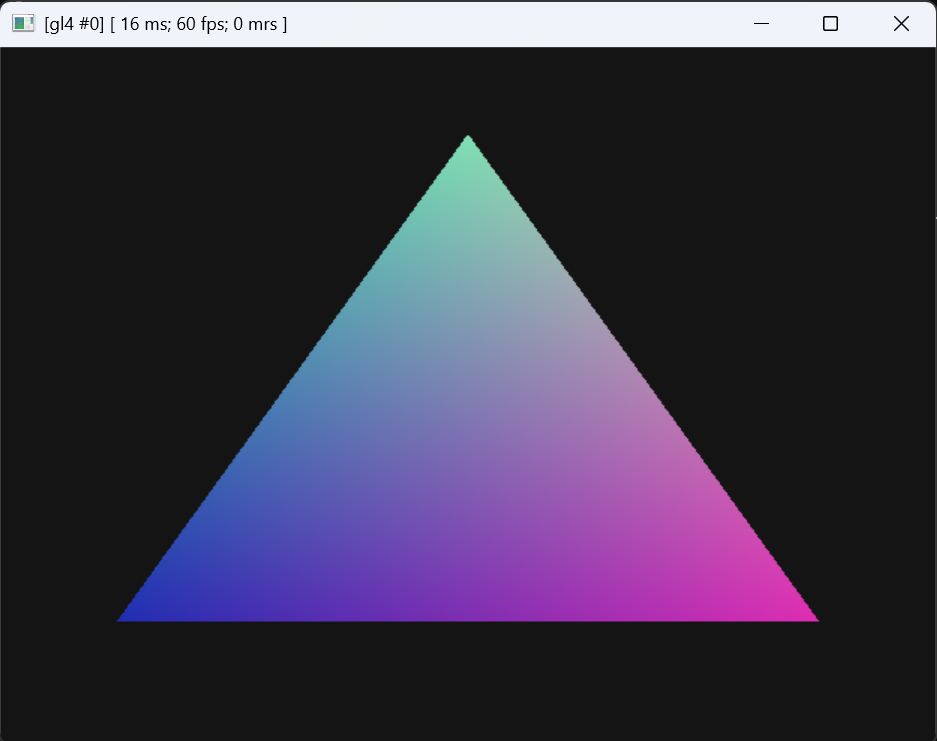

### 01 Window Lifecycle

Open and close a D3D11 window while the OpenGL window continues running.
On Linux, the secondary window uses OpenGL as well. Geometry, shader and color
data are shared across the windows.

[Source](suite_graphics/01_window_lifecycle.cpp) | [Run guide](BUILDING.md#runtime-window-lifecycle)

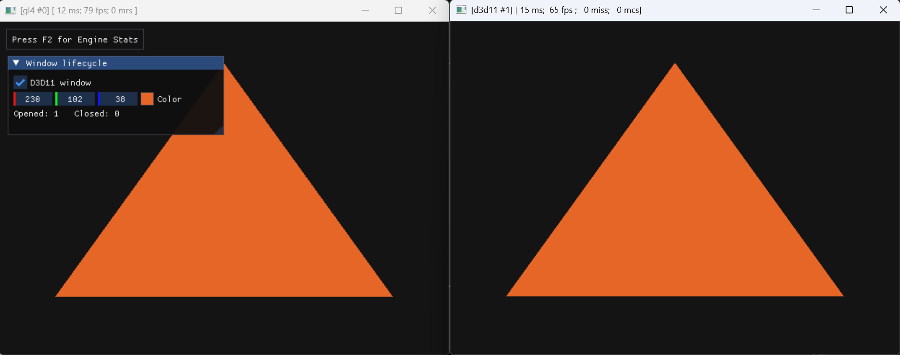

### 02 Dynamic Geometry

Add and remove a square at runtime using geometry links and variable sets,
without reconfiguring the entire shader for every change.

[Source](suite_graphics/02_dynamic_geometry.cpp) | [Run guide](BUILDING.md#dynamic-geometry-and-variable-sets)

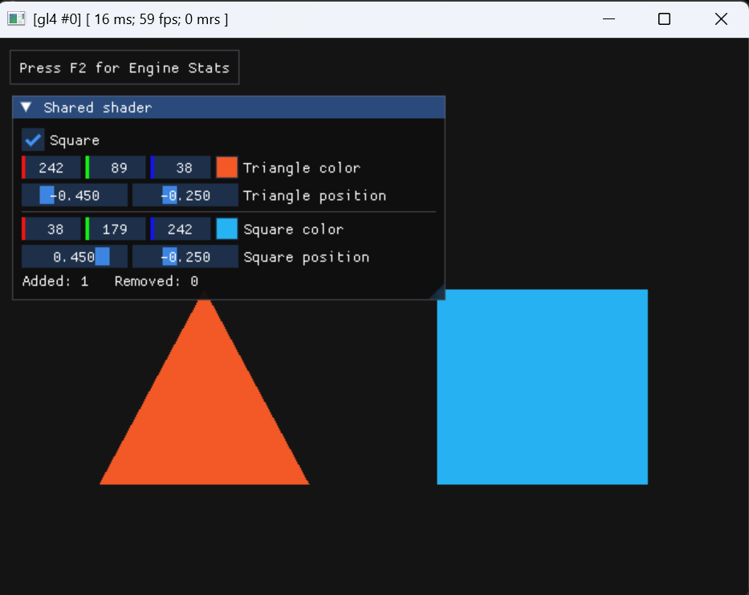

### 03 Shared Scene

Three animated cubes exercise shared resources, sparse variable-set IDs,
different draw order and secondary-window recreation.

[Source](suite_graphics/03_shared_scene.cpp) | [Guide and verification](suite_graphics/03_shared_scene.md)

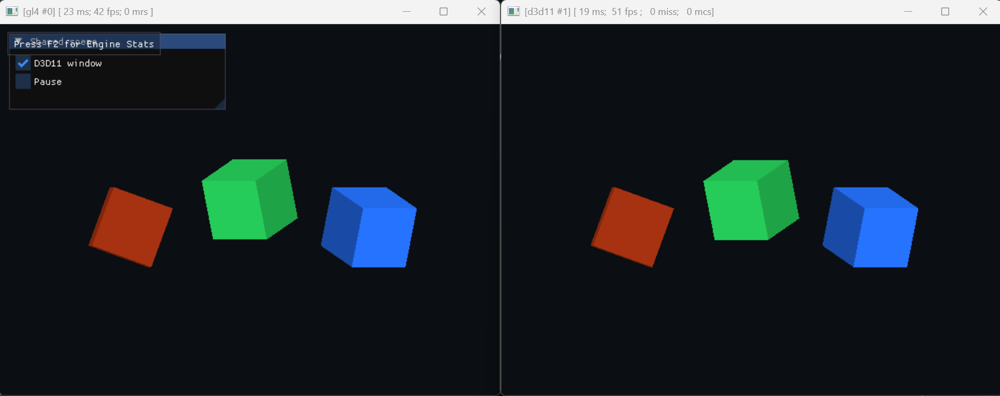

### 04 Configure and Reconfigure

Two checkerboard-textured quads test independent texture changes, reconfiguration
and release followed by configuration, on one or both backends.

[Source](suite_graphics/04_reconfigure.cpp) | [Guide and verification](suite_graphics/04_reconfigure.md)

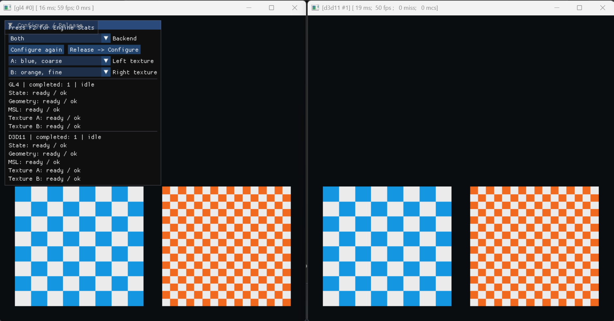

### 05 Scene Benchmark

Configurable object and light counts compare direct rendering with scene-graph
traversal, and multipass lighting with two or three lights evaluated in one pass.

[Source](suite_graphics/05_scene_benchmark.cpp) | [Methodology and results](suite_graphics/05_scene_benchmark.md) | [Benchmark runner](suite_graphics/run_scene_benchmark.ps1)

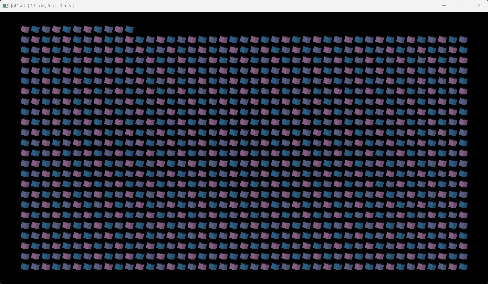

### 06 Vertex Pulling

Side-by-side comparison of vertex data fetched from an array buffer and the
same geometry rendered through conventional vertex attributes.

[Source](suite_graphics/06_vertex_pulling.cpp) | [Guide and verification](suite_graphics/06_vertex_pulling.md)

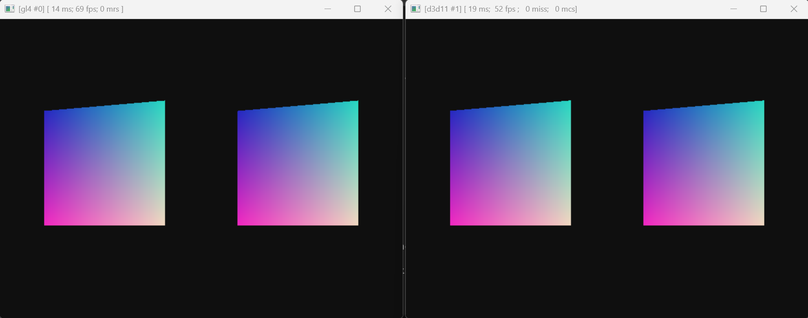

### 07 Vertex Pulling Field

A wave field of rounded cubes with shared mesh data and per-object data in
array buffers. The scene is submitted as one indexed draw per window.

[Source](suite_graphics/07_vertex_pulling_field.cpp) | [Workloads and controls](suite_graphics/07_vertex_pulling_field.md)

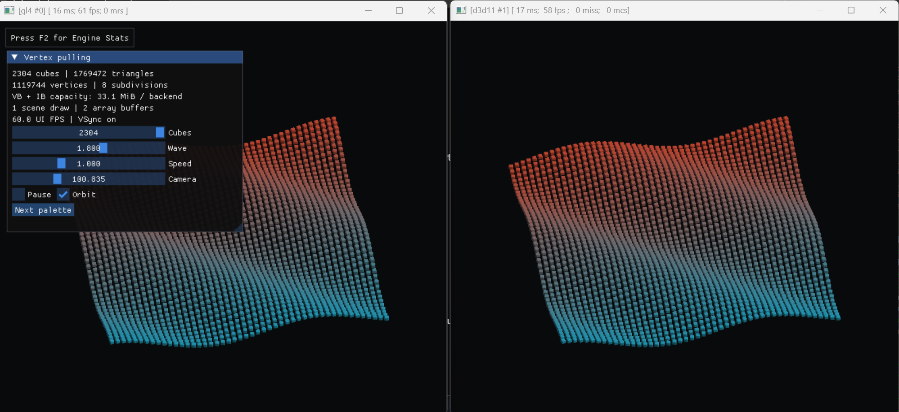

### 08 Render to Texture

Render animated cubes into a framebuffer, then display its color target through
a post-processing shader. Exercises target orientation, resizing and render states.

[Source](suite_graphics/08_render_to_texture.cpp) | [Guide and verification](suite_graphics/08_render_to_texture.md)

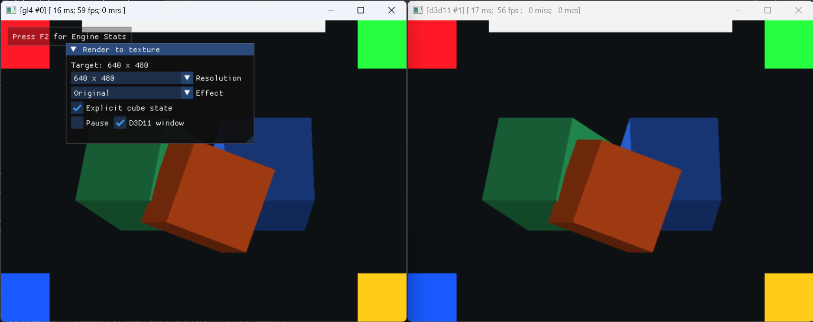

### 09 Geometry Shader

Compare a reference mesh with geometry-shader variants, including triangle
displacement and an additional shell.

[Source and command-line options](suite_graphics/09_geometry_shader.cpp)

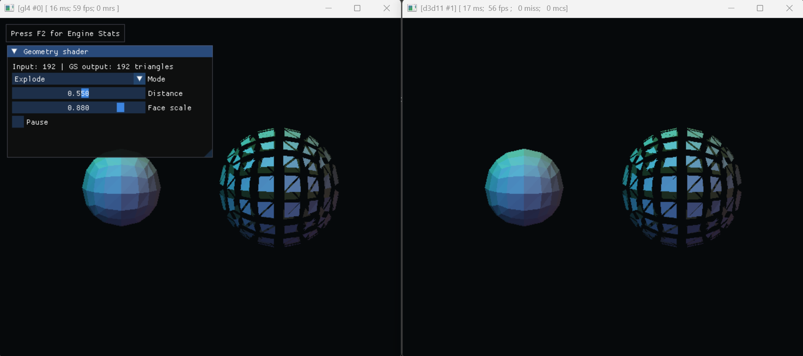

### 10 Transform Feedback

Capture and filter a 50 x 50 x 50 lattice on the GPU, then render the retained
points as cubes. A visible cutting plane illustrates the geometry-shader filter.

[Source](suite_graphics/10_transform_feedback.cpp) | [Modes and verification](suite_graphics/10_transform_feedback.md)

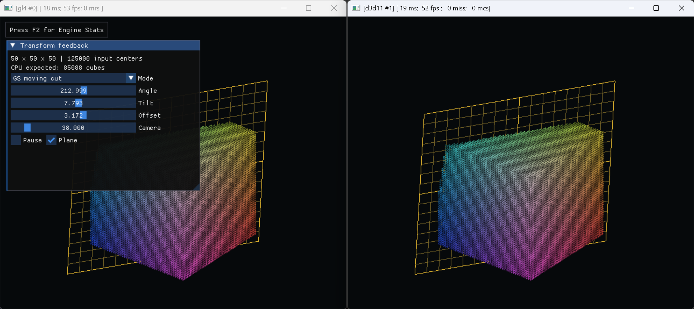

### 11 Lighting Gallery

A small scene with cubes, spheres, tori and a checkerboard floor, lit by three
colored directional lights. Compare single-pass and additive multipass lighting.

[Source](suite_graphics/11_lighting_scene.cpp) | [Rendering paths and controls](suite_graphics/11_lighting_scene.md)

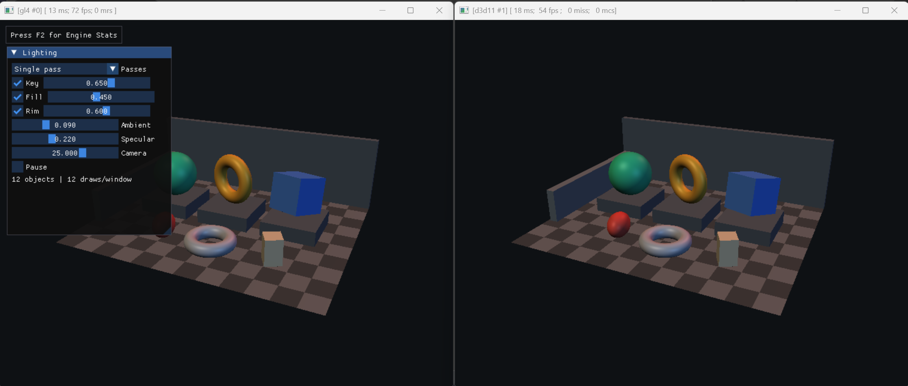

### 12 Scene Graph + Wire Lighting + HDR

The gallery built around scene nodes, components and visitors. Wire slots drive
transforms, material and light values; a parent group moves the exhibits, and
two camera views use separate render-data subsets in the same graph.
Motor's gfx post-processing pipeline adds Bloom, tone mapping and FXAA, with
editable stage properties and a direct-rendering comparison switch.

[Source](suite_graphics/12_scene_wire_lighting.cpp) | [Graph, data flow and verification](suite_graphics/12_scene_wire_lighting.md)

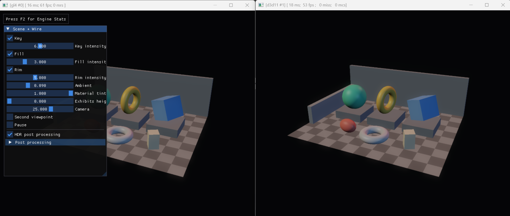

## Console Tests

These applications do not render a scene. Their output consists of checks,
diagnostics and, where applicable, benchmark measurements.

| Area | Application | Purpose | Documentation |
| --- | --- | --- | --- |
| Concurrency | [00_threads_parallel_for](suite_concurrent/00_threads_parallel_for.cpp) | Native threads, Motor's pool, ranges and nested parallel work | [Concurrent tests](BUILDING.md#concurrent-console-tests) |
| Concurrency | [01_sync_primitives](suite_concurrent/01_sync_primitives.cpp) | Semaphore, signals, shared readers and writer exclusion | [Synchronization tests](suite_concurrent/README.md) |
| Concurrency | [02_task_graph](suite_concurrent/02_task_graph.cpp) | Chain, diamond and fan-out graphs with both schedulers | [Task-graph tests](suite_concurrent/README.md) |
| Memory | [00_memory_ownership](suite_memory/00_memory_ownership.cpp) | Share, borrow, move, release guards and concurrent reference counting | [Memory tests](suite_memory/README.md) |
| Memory | [01_memory_allocations](suite_memory/01_memory_allocations.cpp) | Allocation accounting, array destruction, containers and malloc guards | [Memory tests](suite_memory/README.md) |
| Wire | [00_wire_slots](suite_wire/00_wire_slots.cpp) | Fan-out, exchange, type checks and connection lifetime | [Wire tests](BUILDING.md#wire-console-tests) |
| Wire | [01_wire_bridges](suite_wire/01_wire_bridges.cpp) | Input/output bridges, rebinding and variable-set replacement | [Wire tests](BUILDING.md#wire-console-tests) |
| Core | [00_document](suite_core/00_document.cpp) | Token correctness and comparison with standard-library approaches | [Document tests](suite_core/README.md) |
| Core / IO | [01_document_obj](suite_core/01_document_obj.cpp) | Load OBJ text through Motor's database and compare tokenization | [OBJ benchmark](suite_core/README.md#sponza-obj-via-motor-io) |
| Math | [00_vector](suite_math/00_vector.cpp) | Arithmetic, normalization and cross products | [Math tests](suite_math/README.md) |
| Math | [01_matrix](suite_math/01_matrix.cpp) | Products, transpose, homogeneous coordinates and 2D rotation | [Math tests](suite_math/README.md) |
| Math | [02_transformation](suite_math/02_transformation.cpp) | TRS, hierarchy, cameras and projection | [Math tests](suite_math/README.md) |
| Math | [03_util](suite_math/03_util.cpp) | Scalar functions, angles, time, indices and orthonormal bases | [Math tests](suite_math/README.md) |
| Math | [04_quaternion](suite_math/04_quaternion.cpp) | Axis rotations, composition, matrix conversion and SLERP | [Math tests](suite_math/README.md) |

## Testing and CI

Build all targets, then run the console suites:

```sh
cmake --build build --config Release --parallel 4
ctest --test-dir build -C Release -L "concurrent|wire|core|math|memory" --output-on-failure --no-tests=error
```

The [Windows build](.github/workflows/cmake-win32-dx11.yml) and
[Linux build](.github/workflows/cmake-lin-gcc-gl.yml) compile all targets in Debug
and Release. Separate [Windows CTest](.github/workflows/ctest-win32.yml) and
[Linux CTest](.github/workflows/ctest-linux.yml) workflows build only the console
test targets and their dependencies, then execute these tests in both configurations.
Each badge reports its own workflow: a test failure does not fail the build workflow.
The CTest status includes its configure/build prerequisites, not just test assertions.
The workflows run independently on pushes and pull requests to main, or manually;
they do not transfer build artifacts between jobs. This repeats compilation of
the console tests and their dependencies, but does not rebuild the graphics samples
in the CTest workflows. Graphics-runtime and pixel verification are not covered.
The OBJ test is registered only when its external test asset is present at
CMake configuration time.

Graphics smoke tests require a suitable interactive desktop and graphics driver.
Their linked documents explain the checked conditions and known limitations.
A successful smoke run is not automatically a correct-image test; memory dumps
cover Motor-tracked allocations, not every possible GPU allocation.

Older observations and timings document particular engine revisions and machines.
They should not be read as current failures or universal performance guarantees.
